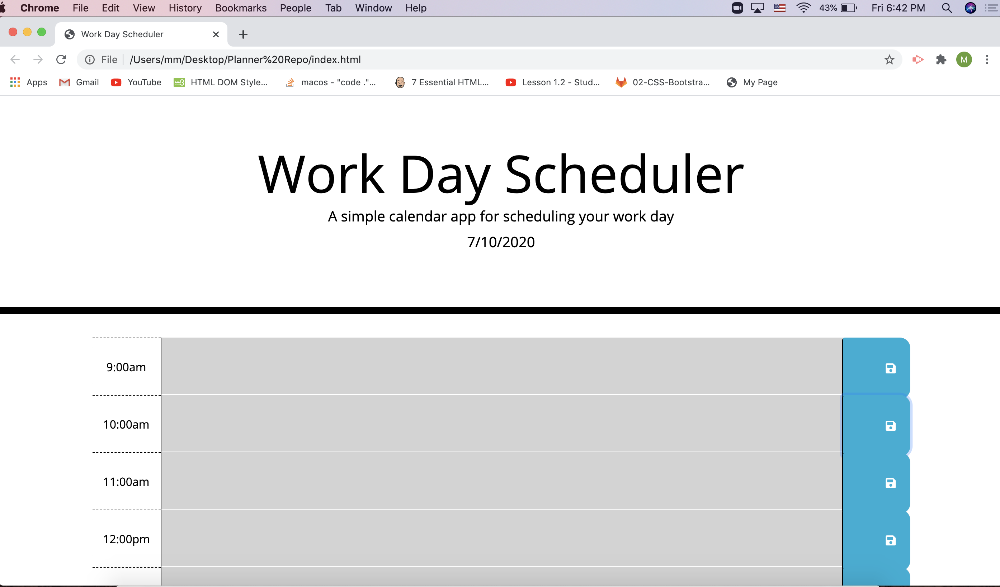

-Collaborated with Tiffany Lombardi, Michael Habert, James Kim, Nathan Paecchi and Cammeryne Sullivan

-we first added blocks to the HTML with the help of Michael

-created dependencies and variables which we then used in functions

-to get the curent date we found a my date function that is vanilla javascript but later changed it using moment (the old code is commented out to better help me understand vanilla javascript and how it correlates with jquery)

-time object was created in military time because its repeatable

-Worked with Justin Ramirez who provided neccesary code that would color assign the text blocks using a loop function that used time as a variable

-didn't touch style css sheet

-made a for loop that looped each time block but this was later commented out with moment and jquery that was implemented

-ended up making the entire js file jquery
